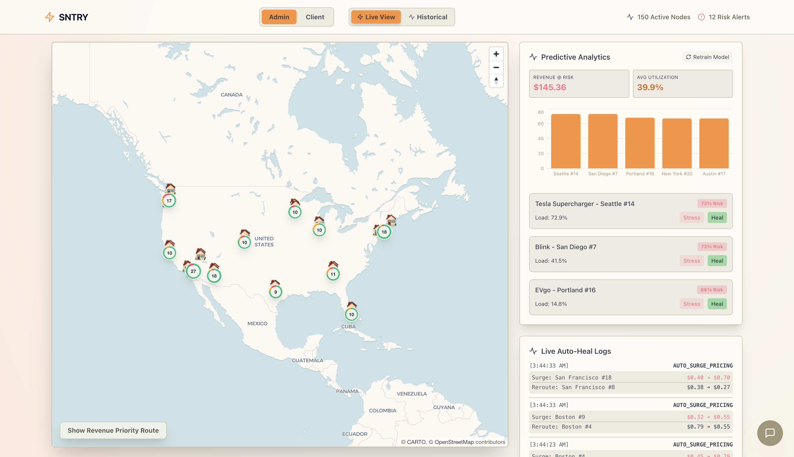
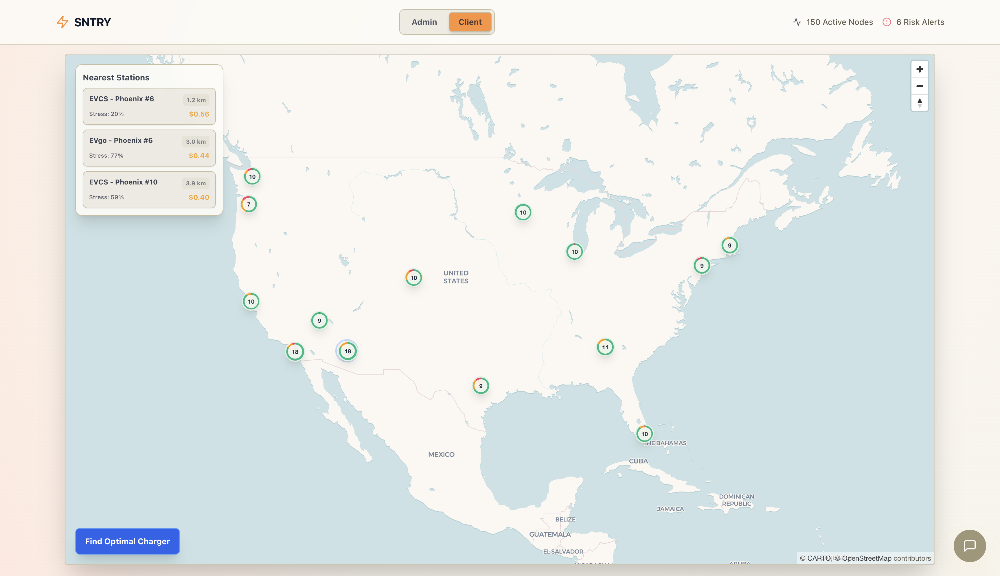

# Sntry: Autonomous Predictive Maintenance & Load Balancing for EV Infrastructure

**Sntry** is an AI-powered operating system for Electric Vehicle (EV) charging networks. It uses real-time predictive maintenance, machine learning anomaly detection, and automated dynamic pricing to prevent charging station downtime, balance grid loads, and maximize infrastructure revenue.

## The Core Problem & Solution
EV charging infrastructure is currently plagued by high failure rates (up to 30% of public chargers are broken at any given time). When chargers go down, providers lose revenue and drivers are left stranded.

**Sntry solves this by:**
1. **Predicting failures before they happen:** Using an ML Random Forest model trained on millions of data points to flag at-risk hardware.
2. **Autonomous Self-Healing:** Utilizing "Dynamic Surge Pricing" to autonomously reroute traffic away from overheating or stressed chargers toward nearby healthy nodes, literally cooling down the stressed hardware and preventing an outage.
3. **Root-Cause Analysis:** An integrated LLM agent instantly categorizes failures and dispatches technicians with the exact replacement parts and turn-by-turn routing via MapLibre.

---

## Machine Learning Engine 

### 1. Predictive Maintenance Classifier (Random Forest)
The core ML pipeline evaluates 33 dimensions of telemetry (Temperature, Weather, Usage, Traffic, etc.) to predict the real-time operational state of the station.
- **Training Data:** Sntry was trained on a massive 339MB `ev_charging_station_data` dataset comprising over **1.3 million historical telemetry logs** across 150 unique EV stations.
- **Classes:** `operational`, `offline`, `partial_outage`, `under_maintenance`.
- **Primary Predictors:** The model dynamically determined that `estimated_wait_time_mins` (62% importance), `temperature_f` (4%), `utilization_rate` (4%), and `ports_total` (4%) were the strongest warning signs of an impending crash.

### 2. Root Cause Anomaly Clustering (K-Means)
To give technicians immediate context, an unsupervised **K-Means Clusterer** was trained strictly on the 103,000+ historical failure events. When the Random Forest predicts an outage, the Anomaly Clusterer groups the telemetry fingerprint into a Root Cause bracket (e.g., Thermal Overload, Network Disconnect) to speed up repairs.

---

## Live Data Simulation & Telemetry Architecture

Because live EV network hardware isn't publicly accessible, Sntry runs a continuous real-time data simulation engine to emulate a live map.

### Live Metrics Polling (The `tick`)
Every 10 seconds, the frontend polls the backend `/api/simulation/tick` endpoint. The backend simulates live data by:
1. Finding historical records from the 1.3M row dataset that match the exact **Current Month and Current Hour of the Day**.
2. Setting the base `utilization_rate` and `temperature_f` to match those historical averages.
3. Injecting a **Gaussian Distribution Noise** ($\mu=0, \sigma=0.2$ for utilization, and $\sigma=2.0$ for temperature) to make the live data organically volatile and realistic.

---

## How the Metrics are Calculated

Sntry calculates the financial and physical network status using the following strict mathematics:

### 1. Load (Utilization Rate / Usage)
- **Base Utilization:** The real-time capacity of the station ranging from `0.0` (Empty) to `1.0` (Full).
- **Historical Average Usage:** Calculated by grouping the timeline of the station and returning the numerical `mean()` of all historical `utilization_rate` data points.

### 2. Physical Stress / Critical States
- Hardware stress is evaluated dynamically by the ML model.
- **Simulation trigger:** To manually demonstrate Sntry's capabilities, users can trigger "Simulate Stress". This manually forces the station's metrics to lethal limits: `utilization_rate = 0.98` (98% full), `temperature = 105.0°F`, and `wait_time = 45 mins`. The ML model instantly traps this signature and elevates the Risk Score to >90%.

### 3. Revenue Loss (Revenue at Risk)
Every minute a highly utilized machine is broken, money is lost.
- **Formula:** `Revenue At Risk = Current Price_Per_kWh * Utilization_Rate * Avg_Session_Duration_Mins`
- **Application:** Sntry sorts the dashboard by this metric, forcing technicians to prioritize repairing the stations that are actively bleeding the most revenue.

### 4. Autonomous Surge Pricing & Healing Reroutes
When a station enters a Critical Stress state (e.g., thermal overload from too many cars), Sntry executes its **Self-Healing Pricing** algorithm to economically force cars to drop the load:
1. **Surge:** The stressed station's `current_price` is multiplied by **`1.75` (+75% Surge)**. 
2. **Impact:** The resulting sticker shock mathematically drops the station's utilization by up to `40%`, immediately cooling the internal hardware down and preventing an offline crash.
3. **Reroute:** To avoid losing the customers entirely, Sntry calculates the **Euclidean Distance** $\sqrt{(x_2-x_1)^2 + (y_2-y_1)^2}$ to find the nearest station with `utilization < 60%`.
4. **Discount:** Sntry drops the healthy neighbor's price by **`-30%`**, pulling the traffic toward it and increasing its load by around `+30%`.

---

### Tech Stack
- **Frontend:** React, Vite, TailwindCSS, MapLibre GL JS, Deck.GL (Supercluster rendering).
- **Backend:** FastAPI, Python, Pandas, Scikit-Learn (Random Forest, K-Means), Joblib.
- **Integrations:** Google Gemini (LLM reasoning on station data), OSRM (Technician routing telemetry).
